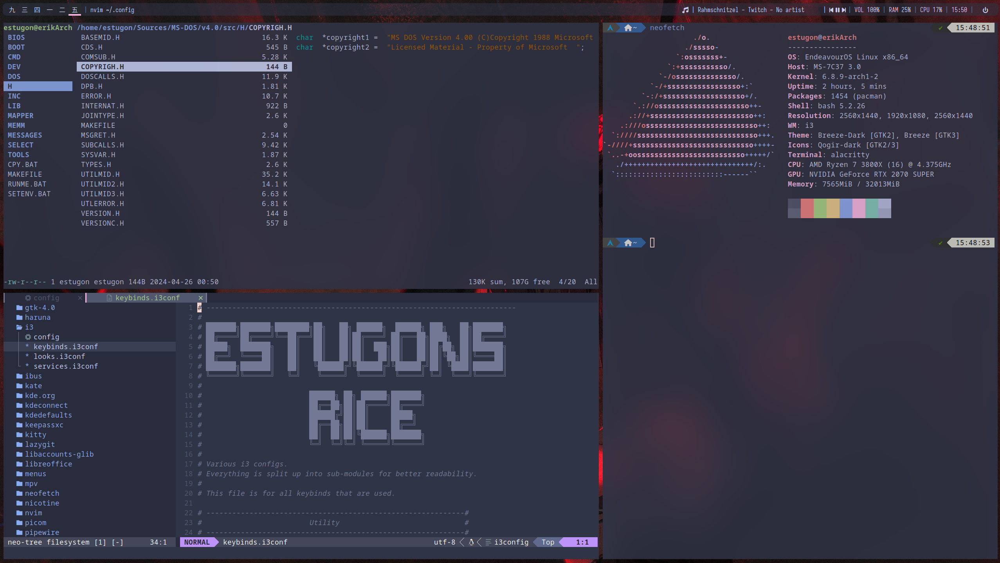
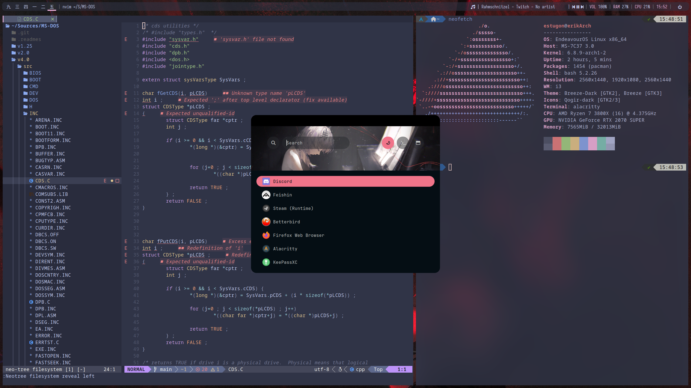

# arch-configs
My configs for arch

Should you want to use this config read everything carefully, or else something might explode.

## credits
### Artworks: 
[https://twitter.com/Dino_illus](https://twitter.com/Dino_illus)

Out of respect for the artist I am not including the artworks themselves in this repo, you will have to download them yourselve from Dino's Twitter/Pixiv
Used artworks:
  * [Wallpaper](https://twitter.com/Dino_illus/status/1708794113603125281/photo/1)
  * [Rofi](https://twitter.com/Dino_illus/status/1686310368367296513) (Put it under .config/rofi/themes/dino_illus_twitter.jpeg)

### Other
The rofi theme is not made by me, but I sadly can't find whoever made this since it's been a while since pulled it. If you know where I took it from, please tell me so I can credit them!

## screenshots

## requirements

### Basics for displaying everything correctly:

 * i3wm
 * polybar
 * picom
 * feh (specify path to your wallpapers in .config/i3/services.i3conf)
 * rofi

### Further utility changed/mentioned by configs:
 * vivaldi-stable
 * pavucontrol
 * neovim
 * ranger
 * kitty

### Dependancies
 * clangd
 * python3
 * npm
 * For polybar (specify path to script in polybar config): [now-playing](https://github.com/d093w1z/polybar-now-playing)
 * redshift

### Installation commands:
* Basics:
`sudo pacman -Sy i3wm polybar picom feh rofi`
* Further:
`sudo pacman -Sy i3wm polybar picom feh rofi vivaldi pavucontrol neovim ranger kitty`
* Dependencies:
`sudo pacman -Sy i3wm polybar picom feh rofi vivaldi pavucontrol neovim ranger kitty clangd python3 npm`

## how to use
Simply copy all configs to the appropiate directory on your system.
Usually it's enough to copy `.config` to your home directory, e.g. `~/`
